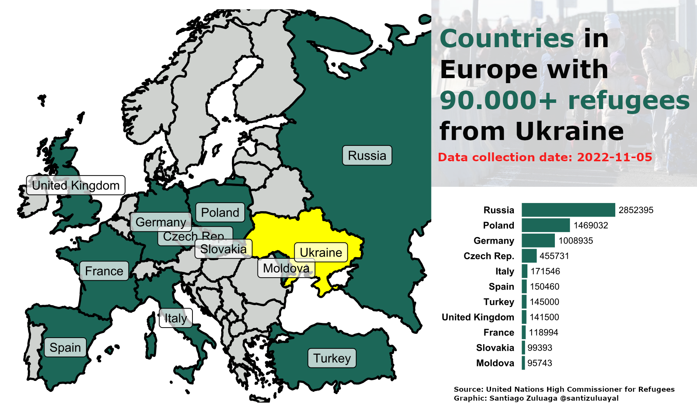
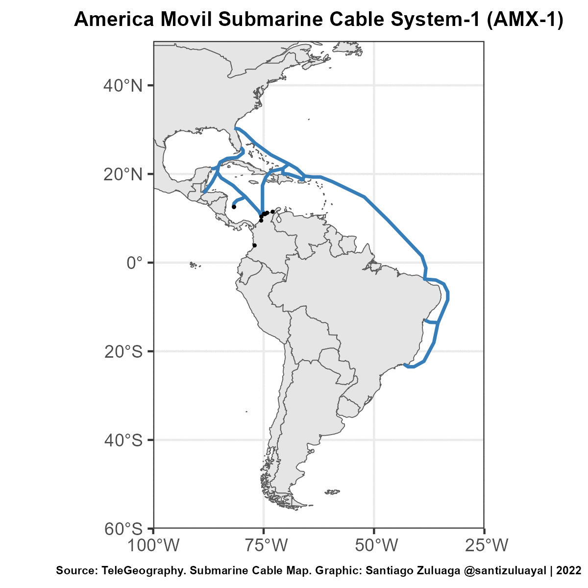
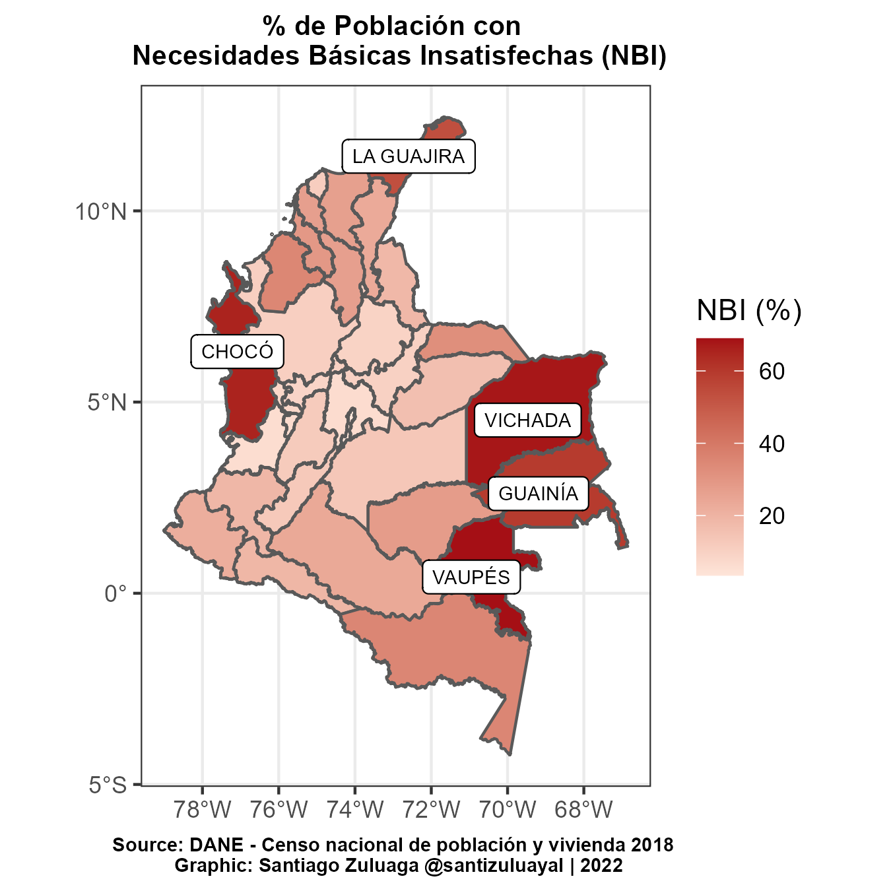
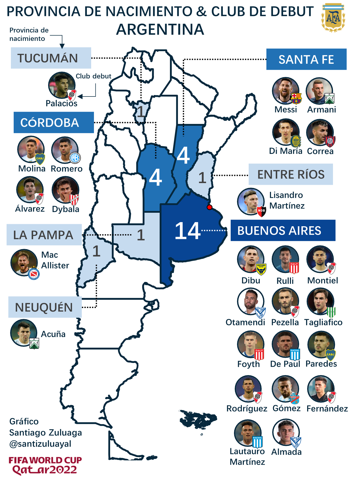

# 30DayMapChallenge

I joined to the [30DayMapChallenge 2022](https://30daymapchallenge.com/), **here are some of the maps created by me.**

## Day 5: Ukraine

Countries in Europa with more than 90000 refugees from Ukraine to 2022-Nov-05.

**Tools**: R + GIMP

## Day 6: Network

Animation showing Submarine Cables Landing in Colombia (Cables Submarinos [de Internet] que llegan a Colombia).
. 
**Tools**: R. [**Code here**](https://github.com/santiagozuluagaa/30DayMapChallenge/blob/main/06-Network/network.R)

## Day 11: Color Red

Population percentage that does NOT meet basic needs - By administrative divisions (departments) - Colombia. This people don't reach a fixed minimum threshold in simple indicators. The most vulnerable departments  are highlighted in the map.

**Tools**: R. [**Code here**](https://github.com/santiagozuluagaa/30DayMapChallenge/blob/main/11-Red/red.r)

## Day 18: Color Blue

Province of Birth & first Club of Argentinian National Team - Qatar 2022 (The Champions!:trophy:)
**Tools**: R + GIMP + PowerPoint

